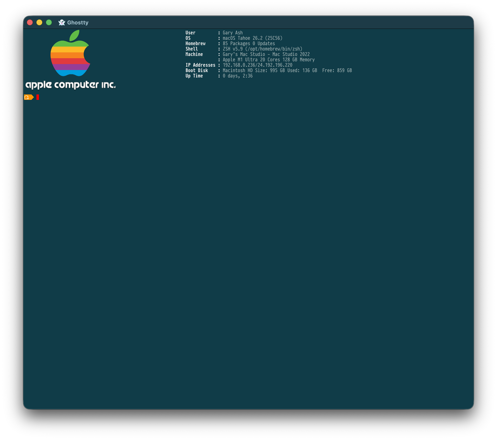

# StartupBanner




A fast, native macOS terminal startup banner that displays system information alongside an Apple logo. Written in Swift with concurrent data gathering for maximum performance.

## What It Does

- **Displays system info** — User, OS version, Homebrew packages, shell, machine model, CPU/memory, IP addresses, disk usage, uptime
- **Apple logo** — Renders via Kitty graphics protocol (PNG) or falls back to colorful ASCII art
- **Concurrent gathering** — All system data is collected in parallel using Swift structured concurrency
- **Native APIs** — Replaces slow subprocess calls with direct sysctl, IOPowerSources, getifaddrs, and statfs calls
- **Theme support** — Light and dark terminal background themes

## Requirements

- macOS 14.0 (Sonoma) or later
- Swift 6.2+ (Xcode 26 or later)
- Kitty-compatible terminal for PNG logo display (optional, ASCII fallback provided)

## Installation

### Building from Source

```bash
cd StartupBanner
swift build -c release
cp .build/release/startup-banner /usr/local/bin/
```

To run the test suite:

```bash
swift test
```

Optionally, place an Apple logo PNG at `/opt/geedbla/pictures/apple-logo.png` for Kitty-protocol image display; otherwise the colorful ASCII fallback is used.

### Shell Integration

Add to your `.zshrc` or `.bashrc`:

```bash
startup-banner --dark
```

## Usage

```
startup-banner [OPTIONS]

Options:
  -l, --light          Light terminal background theme (default)
  -d, --dark           Dark terminal background theme
  -i, --image PATH     Path to a PNG logo for Kitty-protocol display
                       (default: /opt/geedbla/pictures/apple-logo.png)
```

## Project Structure

```
Sources/
├── startup-banner/              StartupBannerLib library target
│   ├── SystemInfo.swift         Data model
│   ├── DataGatherers/           System info collectors (Battery, Disk, GPU,
│   │                            Hardware, Homebrew, Network, OS, Shell,
│   │                            Terminal, Uptime, User) plus the embedded
│   │                            Mac model table (MacModelsData)
│   ├── Display/                 ANSITheme, AppleLogo, BannerRenderer
│   └── Utilities/               SysctlHelpers, SubprocessRunner
├── startup-banner-cli/          startup-banner executable target
│   └── main.swift               Entry point
└── ../Tests/startup-bannerTests/
    └── StartupBannerTests.swift
```

## Acknowledgments

Mac model identification uses the model-name dataset from
[TelemetryDeck/AppleModelNames](https://github.com/TelemetryDeck/AppleModelNames),
embedded directly in source (`MacModelsData.swift`).

## License

Copyright © 2026 Gary Ash. All rights reserved.
